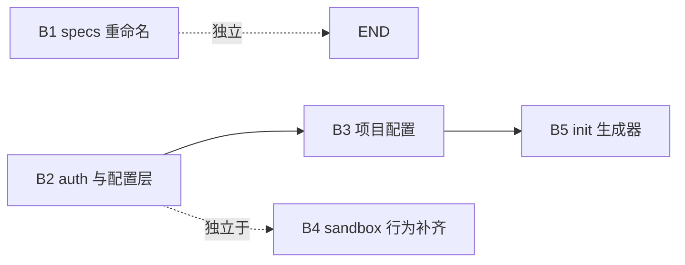

# aone CLI 对齐 Sandbox CLI 实施计划

> 目标：基于 `packages/go/sandbox` 最新 SDK 实现，将 `aone` CLI 的命令、参数、交互行为对齐业界主流 Sandbox CLI 的最佳实践，提升使用体验与可观测性。
>
> 本文为**蓝本文档**，后续每一批改动以「批次」为单位推进，并保持本文与实际代码一致。

---

## 1. 范围与基线

| 项 | 决议 |
|---|---|
| 目标项目 | `/Users/miclle/github/aonesuite/aone/` |
| 命令层级 | `aone auth` / `aone sandbox` / `aone sandbox template` / `aone sandbox volume` |
| 项目级配置文件 | `aone.sandbox.toml`（项目根目录，模板构建相关元数据） |
| 用户级凭证 | `~/.config/aone/config.json`（仅个人凭证，不入库） |
| Specs 目录 | `infra/specs/sandbox/`（由 `infra/specs/e2b/` 重命名而来） |
| 团队（Team）概念 | **完全忽略**，不引入 `team_id` 字段、不实现 `--team` flag |
| auth login 形态 | **MVP 仅支持 API Key 手动输入**；浏览器/device-code 流程后续迭代 |
| 不变量 | 现有 `aone sandbox volume`、`aone sandbox template migrate` 等 aone 特有能力**全部保留** |

---

## 2. 命令对照表

下表以「最佳实践 CLI」为对照基线，列出 aone 现状与目标差异。✅ 已具备，🟡 部分实现需完善，❌ 缺失需新增。

### 2.1 顶层与全局

| 项 | 目标 | 现状 | 差距 |
|---|---|---|---|
| `aone --version` | 显示版本号与 commit | 无 | ❌ 新增（读取 `runtime/debug.ReadBuildInfo`） |
| `aone --debug` | 全局 debug 日志 | 无 | ❌ 新增（写入 `Config.Debug`） |
| `aone help` 自动生成 | cobra 默认即可 | ✅ | — |

### 2.2 `aone auth`

| 子命令 | 目标行为 | 现状 |
|---|---|---|
| `auth login` | 提示输入 API Key（或读 `--api-key`），调用 `/me`（或 `/sandboxes?limit=1`）验证后写入 `~/.config/aone/config.json` | ❌ |
| `auth logout` | 删除 `~/.config/aone/config.json` 中凭证字段 | ❌ |
| `auth info` | 打印当前凭证来源（env / config）、API Key 摘要、endpoint | ❌ |
| `auth configure` | 交互式重写 endpoint / api key | ❌ |

凭证解析优先级（写入 SDK Client）：

```
flag --api-key  >  env AONE_API_KEY  >  ~/.config/aone/config.json[apiKey]
flag --endpoint >  env AONE_SANDBOX_API_URL  >  config.json[endpoint]  >  sandbox.DefaultEndpoint
```

### 2.3 `aone sandbox`

| 子命令 | 目标行为 | 现状 | 待补 |
|---|---|---|---|
| `list` (`ls`) | `--state running,paused`（多值，默认 `running`）`-m key=val` 多次 `--limit` `--format` | 🟡 | state 默认值与多选语义对齐 |
| `create` (`cr`) | positional `[template]`、`-d/--detach`、`--config <aone.sandbox.toml>`、`-p/--path` | 🟡 | 接 `--config` 与 `--path`；前台模式下进入 PTY |
| `connect` (`cn`) | 进入 raw PTY，stdout resize，退出恢复 stty | 🟡 | TTY raw + resize 联动（已有 instance/terminal.go，校验完整性） |
| `kill` (`kl`) | `[ids...]`、`-a/--all`、`-s/--state`、`-m/--metadata` | ✅ | 验证多 id 行为 |
| `pause` (`ps`) | `<id>` | ✅ | — |
| `resume` (`rs`) | `<id>` | ✅ | 已迁移到 SDK `Client.Resume` |
| `info` (`in`) | `<id>`、`-f/--format` | ✅ | — |
| `logs` (`lg`) | `<id>`、`--level`、`-f/--follow`（轮询 400ms）、`--loggers`、`--format` | ✅ | 轮询节奏与停止条件对齐 |
| `metrics` (`mt`) | `<id>`、`-f/--follow` | ✅ | 同上 |
| `exec` (`ex`) | `<id> <cmd...>`、`-b/--background`、`-c/--cwd`、`-u/--user`、`-e KEY=VAL`（可重复）、stdin pipe、退出码透传、SIGINT 转发 | 🟡 | stdin pipe、退出码透传、信号转发 |

### 2.4 `aone sandbox template`

| 子命令 | 目标行为 | 现状 | 待补 |
|---|---|---|---|
| `init` (`it`) | 在 `--path` 下生成 `aone.sandbox.toml` + 示例 `Dockerfile` + 示例代码（ts/python-sync/python-async） | 🟡 | 模板文件渲染（参考 `e2b` `templates/*.hbs` 但**重写为 aone 中性内容**） |
| `create` (`ct`) | `-p/--path`、`-d/--dockerfile`、`-c/--cmd`、`--ready-cmd`、`--cpu-count`、`--memory-mb`、`--no-cache` | 🟡 | flag 命名对齐 |
| `build` (`bd`) | hidden（已废弃，直接走 `create`） | ✅ | 保持 hidden |
| `list` (`ls`) | `--format` | ✅ | — |
| `get` (`gt`) | `<aliasOrId>` | ✅ | — |
| `delete` (`dl`) | `[template]`、`-p/--path`、`--config`、`-s/--select`、`-y/--yes` | 🟡 | 接 `--config` |
| `publish` (`pb`) / `unpublish` (`upb`) | `[template]`、`-p/--path`、`--config`、`-s/--select`、`-y/--yes` | 🟡 | 接 `--config` |
| `migrate` | `-d/--dockerfile`、`--config`、`-l/--language`、`-p/--path` | ✅ | flag 命名校对 |
| `builds` (`bds`) | 列举模板的所有构建 | ✅ | aone 特有，保留 |

### 2.5 `aone sandbox volume`

aone 现有：`list / create / info / delete / ls / cat / cp / rm / mkdir`，**无对应基线**，作为 aone 特有能力**完整保留**。

---

## 3. 配置规范

### 3.1 用户级 `~/.config/aone/config.json`

```json
{
  "endpoint": "https://sandbox.aonesuite.com",
  "apiKey": "ak_xxx",
  "lastLoginAt": "2026-04-25T08:00:00Z"
}
```

- 文件权限 `0600`
- 字段全部 optional，缺失则回退 env / 默认值
- `auth logout` 仅清空 `apiKey` 与 `lastLoginAt`，保留 `endpoint`

### 3.2 项目级 `aone.sandbox.toml`

```toml
template_id   = "tpl_xxx"   # 必填，build 后回写
template_name = "my-app"    # 可选
dockerfile    = "Dockerfile"
start_cmd     = "..."
ready_cmd     = "..."
cpu_count     = 2
memory_mb     = 1024
```

- 路径解析：`--config <file>` > `--path <dir>/aone.sandbox.toml` > 当前目录 `aone.sandbox.toml`
- **不引入 `team_id`**

### 3.3 环境变量

| 变量 | 用途 |
|---|---|
| `AONE_API_KEY` | API Key |
| `AONE_SANDBOX_API_URL` | 控制面 endpoint |
| `AONE_DEBUG` | 启用 SDK debug |
| `AONE_CONFIG_HOME` | 覆盖 `~/.config/aone`（测试用） |

---

## 4. 分批实施路线

每批为一个独立可合并 PR，互不阻塞、可串行也可并行。

| 批次 | 任务 ID | 内容 | 涉及目录 |
|---|---|---|---|
| **B1** | #3 | infra specs `e2b/` → `sandbox/` 重命名（不改 aone） | `infra/` |
| **B2** | #2 | `aone auth` 命令组 + 用户配置层 + Client 凭证优先级 | `cmd/`, `internal/auth/`, `internal/config/`, `internal/sandbox/client.go` |
| **B3** | #5 | `aone.sandbox.toml` 解析与回写；`template create/delete/publish/migrate` 接入 `--config` `--path` | `internal/config/`, `internal/sandbox/template/` |
| **B4** | #4 | `sandbox` 子命令行为补齐：list 默认 state、exec stdin pipe + 退出码透传 + 信号转发、connect TTY 校验、resume 迁移到 SDK | `internal/sandbox/instance/`, `packages/go/sandbox/sandbox.go`（如需补 Resume） |
| **B5** | #1 | `template init` 生成器：渲染 `aone.sandbox.toml` + Dockerfile + 示例代码（中性内容，**不含任何外部品牌字样**） | `internal/sandbox/template/`, 新增 `internal/sandbox/template/templates/` |

依赖关系：



---

## 5. SDK 侧待补能力（与 CLI 同步）

CLI 对齐过程中暴露的 SDK 缺口（非阻塞，可在 B4 顺手补）：

| 能力 | 优先级 | 说明 |
|---|---|---|
| `(*Client).Resume(ctx, sandboxID, ResumeParams)` | P0 | 当前 CLI 走 HTTP 直调，应迁回 SDK |
| 流式 `LogsStream` | P1 | 替代 400ms 轮询；后端就绪后切换 |
| `GetSnapshot(ctx, snapshotID)` | P1 | 单快照查询 |
| Volume `Copy` / `WatchDir` | P2 | 与 Filesystem API 对齐 |
| 函数式 `WithApiKey` / `WithEndpoint` 选项 | P2 | 为 CLI / 上层框架提供更顺手的构造 |

---

## 6. 验收标准

- [ ] `aone auth login --api-key xxx` 写入 `~/.config/aone/config.json` 后，`unset AONE_API_KEY` 仍可用
- [ ] `aone auth info` 在三种凭证来源（flag/env/config）下都能正确指出来源
- [ ] `aone auth logout` 后 `auth info` 提示未登录
- [ ] `aone sandbox template init -l ts -p ./tmp/foo` 生成可立即 `aone sandbox template create` 的项目骨架
- [ ] `aone sandbox create -p ./tmp/foo` 能从 `aone.sandbox.toml` 推断 template
- [ ] `echo "hello" | aone sandbox exec <id> cat` 正确透传 stdin 与退出码
- [ ] `aone sandbox logs <id> -f` 在 sandbox 停止时自动退出
- [ ] 所有命令在 `--format json` 下输出可被 `jq` 解析的合法 JSON
- [ ] `infra/specs/sandbox/` 路径生效，`task sync-aone-e2b-specs` 正常运行（脚本同步重命名）
- [ ] `git grep -in "e2b" aone/cmd aone/internal aone/packages` 仅命中明确说明（如 specs 同步注释），无品牌泄漏到用户可见输出

---

## 7. 风险与缓解

| 风险 | 缓解 |
|---|---|
| 重命名 specs 目录后历史脚本失效 | B1 内一并更新 `scripts/sync-aone-e2b-specs.sh`、README；保留旧目录软链一周作为过渡（如必要） |
| auth 命令引入后用户原 env 流程回归 | 凭证优先级保持 env > config，老用户零感知 |
| `aone.sandbox.toml` 与 `e2b.toml` 字段差异引发迁移成本 | `template migrate` 命令补充 from-`e2b.toml` 的转换分支 |
| 信号转发 / TTY raw 模式跨平台差异 | 复用现有 `terminal_resize_unix.go` / `terminal_resize_windows.go` 拆分模式 |

---

*文档创建时间：2026-04-25*
